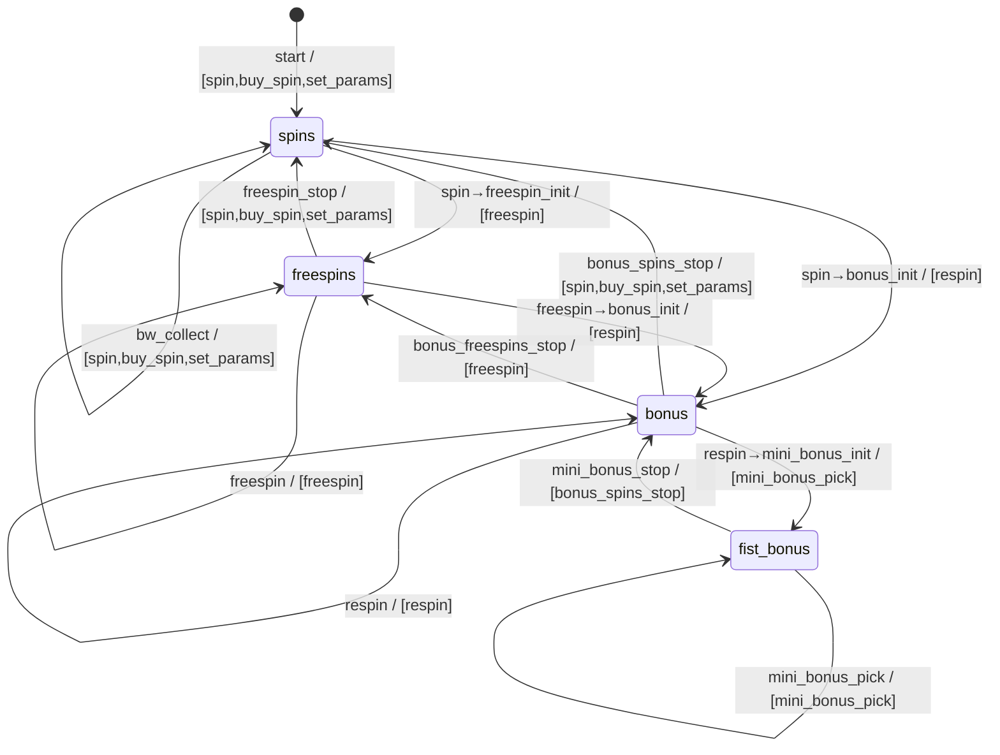

# Zeus Power — State Machine

Server-driven: the response is authoritative. The bot reads `context.current` +
`context.actions` and only sends an advertised action (spec §3). The graph below is derived
verbatim from the capture (`last_action → current / advertised actions`) and is encoded in
`packages/core/src/protocol/state-machine.ts` (`OBSERVED_TRANSITIONS`). The full replay
validates every observed exchange against it (0 illegal transitions).

## Default action policy (spec §6)

| Advertised set | Action sent | Note |
|---|---|---|
| `[spin,buy_spin,set_params]` | `spin` (bet_per_line, lines=20) | never `buy_spin`/`set_params` (uncaptured) |
| `[bw_gamble,bw_collect]` | `bw_collect` | never gamble by default |
| single mandatory continuation | that action | `freespin`, `respin`, `mini_bonus_pick`, `*_stop`, … |
| anything else / unknown / uncaptured | **stop + alert** | pause worker, persist response, raise critical alert |

## Round correlation (spec §8)

No explicit round id in packets. A base round opens on a `spin`; the feature-chain id persists
while `round_finished === false`; free spins / bonus / fist / stop actions / big-win collect
attach to the originating spin; the round closes when `round_finished === true`. The final
feature-chain payout is attributed **once** to the originating paid spin (no double counting).
Algorithm version is persisted (`CORRELATION_ALGORITHM_VERSION`).
